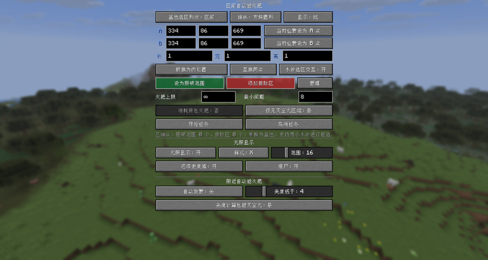

# Auto Torch

[English](README_EN.md) | 简体中文

适用于 Minecraft 1.21.1~26.2 / NeoForge、Forge 和 Fabric 的自动插火把和光照显示模组。


## 开发原因

挖空置域太麻烦了，然后手动插火把也容易遗漏。然后现有的光照显示功能也不支持溺尸和沼泽史莱姆特判，做沼泽刷怪塔或点亮河底时候就不方便了，于是就有了这个模组。

## 简介

- 默认按 `G` 打开选区面板，可以设置区间或附近自动插火把功能
- 默认按 `F7` 开关光照显示，支持溺尸和沼泽史莱姆特判

| 附近插火把 | 光照显示 | 区间插火把    |
| ---------- | -------- | ------------- |
| 纯客户端   | 纯客户端 | 客户端+服务端 |

## 图例




## 使用

- 默认按 `G` 打开选区面板，按 `F7` 开关光照显示，支持修改按键绑定。
- 光照显示功能：
  支持 `X` 标记和数字显示方块光照等级，显示范围：1~64格（优化过性能）。
  | 颜色 | 含义 |
  | ---- | ---- |
  | 红色 | 任何时间刷怪 |
  | 黄色 | 夜间刷怪 |
  | 绿色 | 不刷怪 |
  | 紫色 | 沼泽史莱姆夜间刷新 |
  | 青色 | 溺尸刷新 |
- 附近自动插火把功能：
  搜索玩家附近两格内的有效位置，使用原版右键交互放置物品栏的火把，光照等级低于阈值时才会放置（可选择是否计算天空光）。
- 区间自动插火把功能：
  选取 A/B 两点，定义长方体（对角线）或球体（球心/半径），支持木斧选择。然后设置为照明范围（绿色）或排除区（红色），点击“开始任务”即可。支持一个照明范围和多个排除区。（一般默认最大区间的自然地形在半个背包1000根火把左右）
- 全部的功能都在上图中的设置面板中

## 配置

NeoForge 和 Forge 会在首次加载后自动生成两类配置文件：

> Fabric 没这库，它不会自动生成，要手动添加

- `config/autotorch-client.toml`：保存附近自动插火把、光照显示、选区显示及任务面板默认值等客户端偏好。
- `<世界目录>/serverconfig/autotorch-server.toml`：保存选区尺寸、火把数量、排除区、并发任务，以及单任务和全服每 tick 工作预算等服务端限制。

## 构建

需要 Java 21：

```powershell
$env:JAVA_HOME='你的 Java 21 安装目录'
.\gradlew.bat build
```

生成的 JAR 会自动复制到根目录的 `build` 中并重命名为：

- `build/autotorch-v<模组版本>-mc<MC版本>-<加载器类型>.jar`

运行开发客户端分别使用：

```powershell
.\gradlew.bat :neoforge:runClient
.\gradlew.bat :forge:runClient
.\gradlew.bat :fabric:runClient
```

在 Windows 上，也可以运行 `tools\1.一键启动mc脚本.ps1`。

## 功能

### 附近自动插火把

- 纯客户端功能，服务端无需安装本模组。
- 开启后每 10 tick 扫描一次玩家水平半径 2 格、纵向 -2~+1 格内的位置，并优先选择距离玩家最近的暗处。
- 只会在空气、无流体、火把可以正常存活且不会与玩家碰撞的位置放置。
- 使用副手或快捷栏中的普通火把，通过原版右键交互完成放置，因此仍受冒险模式、领地保护、交互距离等服务端规则限制。
- 可以设置触发放置的光照阈值（1~16），并选择判断光照时是否计入天空光。关闭天空光计算后，露天区域也会按方块光判断。
- 临时切换快捷栏放置火把后会自动切回原来的物品栏槽位；同一失败位置会等待 40 tick 后再重试。

### 光照显示

- 纯客户端功能，默认按 `F7` 开关，也可以在 `G` 面板中设置。
- 以玩家为中心增量扫描周围区域，水平显示范围可设为 1~64 格；玩家移动后会自动刷新，扫描过程经过分帧处理。
- 支持 `X` 标记和光照数字两种显示模式。数字为方块光照等级，颜色同时表示对应位置的刷新风险。
- 普通标记会检查脚部和头部空间、脚下方块碰撞面以及原版地面生物生成条件，避免把不可站立的位置标为可刷怪点。
- 可单独开启沼泽史莱姆特判：检查高度、生物群系、方块光和原版史莱姆生成条件，并用紫色标记风险位置。
- 可单独开启溺尸特判：检查连续水体、生物群系刷新列表、海平面与方块光，并用青色标记有效水柱顶部。

### 区间自动插火把

- 客户端负责选区和任务设置，服务端负责校验、扫描与放置；多人游戏需要客户端和服务端都安装本模组。
- 可在面板中输入 A/B 坐标、使用“当前位置”，或用木斧左键/右键选择两点。木斧选区可关闭，启用时会拦截对应交互以免误破坏方块。
- 长方体以 A/B 为两个对角点；球体以 A 为球心、A 到 B 的直线距离为半径。面板支持内切球/外接立方体转换。
- 每名玩家可设置一个绿色照明范围和多个红色排除区；选区可以显示为半透明面或轮廓线，球体还可启用平滑显示。
- 任务只处理方块光为 0、脚部和头部为空气、脚下可站立的位置。“仅地下”开启时还会跳过有天空光的位置。
- 火把位置优先选择暗点脚下，无法放置时会在附近随机寻找有效位置；只处理已加载区块，不会强制加载区块。
- 扫描分两轮执行：第一轮使用设定的最小间距，第二轮使用较小间距补齐仍未照亮的位置。扫描量和放置量均按 tick 限流，多个玩家的任务会轮流获得预算。
- 可限制任务最多放置的火把数，`0` 表示无限；可分别设置生存和创造模式是否消耗背包中的普通火把。任务参数会由服务端校验，多人游戏的生存模式消耗规则以服务端配置为准。
- 同一玩家同时只保留一个任务；开始新任务会替换旧任务，也可以重新打开面板取消正在执行的任务。

## 配置文件

配置文件中的开关布尔值使用 `true`/`false`（不要双引号）。

### Forge / NeoForge 客户端配置

文件位置：`config/autotorch-client.toml`

```toml
[nearbyAutoTorch]
# 是否启用附近自动插火把。
enabled = false
# 光照低于此值时尝试放置火把，范围 1~16。
lightThreshold = 4
# true：使用方块光与天空光中的较大值；false：只判断方块光。
includeSkyLight = true

[lightOverlay]
# 是否启用光照显示。
enabled = false
# 以玩家为中心的水平显示范围，范围 1~64 格。
horizontalRange = 16
# true：显示光照数字；false：显示 X 标记。
showNumbers = false
# 是否标记符合原版条件的沼泽史莱姆刷新位置。
detectSwampSlimes = false
# 是否标记符合原版条件的溺尸刷新位置。
detectDrowned = false

[selectionOverlay]
# 是否显示照明范围和排除区。
enabled = true
# true：只显示轮廓线；false：显示半透明面。
linesOnly = false
# 是否使用更平滑的球形选区显示。
smoothSpheres = false

[lightingTaskDefaults]
# 任务默认最大火把数，范围 0~4096；0 表示无限。
maxTorches = 0
# 火把默认最小间距，范围 3~12 格。
minSpacing = 8
# 是否默认只处理无天空光的位置。
undergroundOnly = true
# 创造模式是否默认消耗背包中的火把。
creativeConsumeTorches = false
# 单人游戏中，生存模式是否默认消耗背包中的火把。
# 多人游戏以服务端 gameplay.survivalConsumesTorches 为准。
survivalConsumeTorches = true
# 是否启用木斧左键/右键选取 A/B 点。
woodenAxeSelectionEnabled = true
```

### Forge / NeoForge 服务端配置

文件位置：`<世界目录>/serverconfig/autotorch-server.toml`

```toml
[limits]
# 长方体任一边允许的最大长度，范围 1~257 格。
maxBoxAxisLength = 257
# 球形选区允许的最大半径，范围 1~160 格。
maxSphereRadius = 160
# 单个任务允许提交的最大排除区数量，范围 0~32。
maxExclusions = 32
# 单个任务允许设置的最大火把数，范围 1~4096。
maxTorchesPerTask = 4096
# 是否允许客户端将最大火把数设为 0（无限）。
allowUnlimitedTorches = true
# 客户端可设置的火把间距下限和上限，范围均为 3~12。
minSpacing = 3
maxSpacing = 12
# 全服可同时运行的任务数，范围 1~1024。
maxConcurrentTasks = 64

[gameplay]
# 生存模式任务是否必须消耗玩家背包中的普通火把。
survivalConsumesTorches = true

[performance]
# 每个任务每 tick 最多扫描的方块数，范围 1~120000。
scanBudgetPerTaskTick = 12000
# 每个任务每 tick 最多放置的火把数，范围 1~64。
placeBudgetPerTaskTick = 8
# 全服所有任务每 tick 最多扫描的方块总数，范围 1~240000。
globalScanBudgetPerTick = 24000
# 全服所有任务每 tick 最多放置的火把总数，范围 1~256。
globalPlaceBudgetPerTick = 16
# 为每个暗点寻找可放置火把位置时的最大尝试次数，范围 1~128。
randomPlacementAttempts = 32
```

降低 `scanBudgetPerTaskTick` 和 `globalScanBudgetPerTick` 可以减少扫描造成的单 tick 压力，但会延长任务时间；放置预算同理。全服预算是硬上限，单任务实际获得的预算还会根据同时运行的任务数分配。

### Fabric 配置

Fabric 使用 Java properties 格式，文件位于 `config/autotorch-client.properties` 和 `config/autotorch-server.properties`。文件不会在首次启动时完整生成；通过面板修改客户端选项后会写入客户端文件，服务端文件需要手动创建。未填写的键使用上述默认值。

客户端文件的完整默认内容：

```properties
nearbyAutoTorch.enabled=false
nearbyAutoTorch.lightThreshold=4
nearbyAutoTorch.includeSkyLight=true
lightOverlay.enabled=false
lightOverlay.horizontalRange=16
lightOverlay.showNumbers=false
lightOverlay.detectSwampSlimes=false
lightOverlay.detectDrowned=false
selectionOverlay.enabled=true
selectionOverlay.linesOnly=false
selectionOverlay.smoothSpheres=false
lightingTaskDefaults.maxTorches=0
lightingTaskDefaults.minSpacing=8
lightingTaskDefaults.undergroundOnly=true
lightingTaskDefaults.creativeConsumeTorches=false
lightingTaskDefaults.survivalConsumeTorches=true
lightingTaskDefaults.woodenAxeSelectionEnabled=true
```

服务端文件的完整默认内容：

```properties
limits.maxBoxAxisLength=257
limits.maxSphereRadius=160
limits.maxExclusions=32
limits.maxTorchesPerTask=4096
limits.allowUnlimitedTorches=true
limits.minSpacing=3
limits.maxSpacing=12
limits.maxConcurrentTasks=64
gameplay.survivalConsumesTorches=true
performance.scanBudgetPerTaskTick=12000
performance.placeBudgetPerTaskTick=8
performance.globalScanBudgetPerTick=24000
performance.globalPlaceBudgetPerTick=16
performance.randomPlacementAttempts=32
```

## 限制与安全

- 默认情况下长方体每条边最多 257 格，球形半径最多 160 格（直径 320 格）；服主可以修改配置调整。
- 模组不会强制加载区块；扫描到未加载区块时会跳过。（一般视距>=8 都是会被加载的）
- “可刷怪”使用适合原版常见敌对生物的保守判断，没添加覆盖其他模组的特判。
- 不兼容领地插件。使用的是原版的 `/setblock`。
