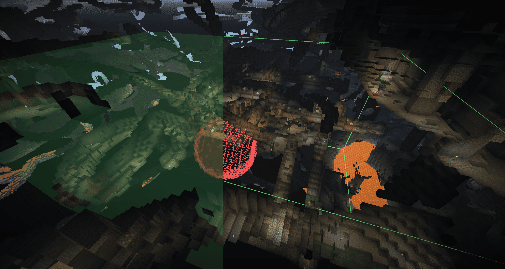
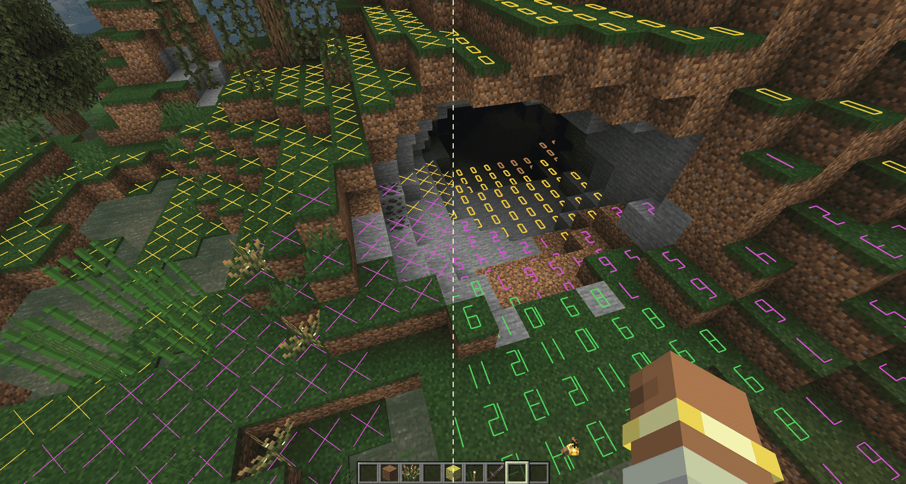
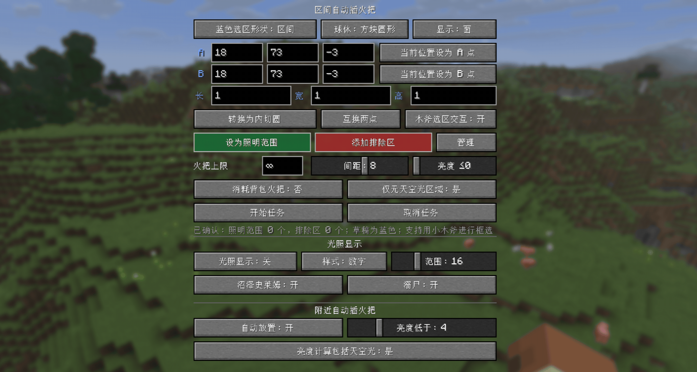

# Auto Torch

[English](./docs/all_readme/README_EN.md) | 简体中文

适用于 Minecraft 1.7.10~26.3 / NeoForge、Forge、Fabric 和 网易版 的自动插火把和光照显示模组。


## 开发原因

挖空置域太麻烦了，然后手动插火把也容易遗漏。然后现有的光照显示功能也不支持溺尸和沼泽史莱姆特判，做沼泽刷怪塔或点亮河底时候就不方便了，于是就有了这个模组。

## 简介

- 默认按 `G` 打开选区面板，可以设置区间或附近自动插火把功能
- 默认按 `F7` 开关光照显示，支持溺尸和沼泽史莱姆特判

| 附近插火把 | 光照显示 | 区间插火把    |
| ---------- | -------- | ------------- |
| 纯客户端   | 纯客户端 | 客户端+服务端 |

## 图例





## 使用

- 默认按 `G` 打开选区面板，按 `F7` 开关光照显示，支持修改按键绑定。
- 也可以使用命令，完整用法见 [命令使用文档](./docs/命令使用.md)。
- 光照显示功能：
  支持 `X` 标记、数字和方框数字三种样式显示方块光照等级，显示范围 水平：1~64 格，竖直：可选上下各64格（最大64格）（优化过性能）。
  | 颜色 | 含义 |
  | ---- | ---- |
  | 红色 | 任何时间刷怪 |
  | 黄色 | 夜间刷怪 |
  | 绿色 | 不刷怪 |
  | 紫色 | 沼泽史莱姆夜间刷新 |
  | 青色 | 溺尸刷新 |
- 附近自动插火把功能：
  搜索玩家附近两格内的有效位置，使用右键交互放置物品栏的火把，光照等级低于阈值时才会放置（可选择是否计算天空光）。
- 区间自动插火把功能：
  选取 A/B 两点，定义长方体（对角线）或球体（球心/半径），支持木斧选择。然后设置为照明范围（绿色）或排除区（红色），调整方块光阈值并点击“开始任务”即可。支持一个照明范围和多个排除区。
- 全部的功能都在上图中的设置面板中

## 构建

```powershell
.\gradlew.bat build
```

生成的 JAR 会自动复制到根目录的 `build` 中并重命名为：

- `build/v<模组版本>/autotorch-v<模组版本>-mc<MC版本>-<加载器类型>.jar`

运行开发客户端分别使用：

```powershell
.\gradlew.bat :neoforge:runClient
.\gradlew.bat :forge:runClient
.\gradlew.bat :fabric:runClient
```

在 Windows 上，也可以运行 `tools\1.一键启动mc脚本.py`。

## 提交翻译

欢迎为模组添加或完善翻译。翻译文件位于 `common/src/main/resources/assets/autotorch/lang/`。

不同 Minecraft 版本使用不同的维护分支和语言文件格式：

| Minecraft 版本       | Pull Request 的目标分支 | 语言文件格式 |
| -------------------- | ----------------------- | ------------ |
| 当前开发版（最新版） | `main`                  | `.json`      |
| 1.7.10~1.12.2        | `mc/<版本>`             | `.lang`      |
| 1.13.2 及以上        | `mc/<版本>`             | `.json`      |

提交翻译时，请提交 `.json` 到 PR 并选择 `main`，不要提交到别的 `mc/x.x.x` 分支，到时候会人工合并。

> `.json`会用脚本自动转换成 `.lang` 文件。

1. Fork 本仓库，从 `main` 分支创建一个新分支。
2. 在目标分支中复制语言文件 `zh_cn.json`，然后人工或让AI翻译（最好人工校对）。
3. 添加对应语言的 README 文件。
4. 然后提交，记得查看是否是 `UTF-8` 编码。

## 详细说明

### 附近自动插火把

- 开启后每 10 tick （0.5秒）扫描一次玩家水平半径 2 格、纵向 -2~+1 格内的位置，从近到远插火把，失败后 40 tick (2秒) 后再重试。
- 只会在空气、无流体等火把可以正常存活且不会与玩家碰撞的位置放置。
- 必须要快捷栏中有火把（包括副手）
- 可以设置触发放置的光照阈值（1~16），和是否计算天空光

### 光照显示

- 默认按 `F7` 开关，也可以在 `G` 面板中设置。
- 以当前视角为中心，显示范围水平可设为 1~64 格，纵向可选上下各64格（最大 64）；支持灵魂出窍等mod。
- 支持 `X` 标记、数字和方框数字三种显示样式。
- 支持透视渲染，数字跟随视角旋转。
- 标记会检查当前位置是否会刷怪，还会特判沼泽史莱姆和溺尸的刷新条件，并用不同颜色标记。

### 区间自动插火把

- 可通过输入坐标，或用木斧左键/右键选择两点。
- 长方体以 A/B 为两个对角点；球体以 A 为球心、A 到 B 的直线距离为半径。
- 可设置一个绿色照明范围和多个红色排除区。具有多种显示方式。
- 可设置任务的方块光上限（0~15），任务处理方块光≤该值、2格高为空气、且可站立、方块光为 `0` 的位置。可以跳过有天空光的位置。
- 火把位置优先选择暗点脚下，否则会在附近随机寻找有效位置；只处理已加载区块，不会强制加载区块。
- 扫描分两轮执行：第一轮使用设定的最小间距，第二轮使用更小间距进行补齐。
- 可限制任务最多放置的火把数，`0` 表示无限；可设置是否消耗背包中的普通火把。
- 同一玩家同时只保留一个任务；新的会覆盖旧的。

## 配置文件

首次加载后会自动生成两类配置文件。
配置文件中的开关布尔值使用 `true`/`false`（不要加双引号）。

### 客户端配置

文件位置：`config/autotorch-client.toml`

```toml
[nearbyAutoTorch]
# 是否启用附近自动插火把。
enabled = false
# 光照低于此值时尝试放置火把，范围 1~16。
lightThreshold = 4
# true：使用方块光与天空光中的较大值；false：只判断方块光。
includeSkyLight = false

[lightOverlay]
# 是否启用光照显示。
enabled = false
# 是否开启透视渲染，开启后可以看到被方块遮挡的标记。
renderThrough = false
# true：光照数字跟随视角旋转；false：数字固定不随视角转动。
numberRotation = true
# 以当前相机为中心的水平显示范围，范围 1~64 格。
horizontalRange = 16
# 相对当前相机向下扫描的格数，范围 0~64；与 upRange 之和不超过 64。
downRange = 16
# 相对当前相机向上扫描的格数，范围 0~64；与 downRange 之和不超过 64。
upRange = 4
# 显示样式：0=X 标记，1=数字，2=方框数字。
mode = 0
# 是否标记符合原版条件的沼泽史莱姆刷新位置。
detectSwampSlimes = false
# 是否标记符合原版条件的溺尸刷新位置。
detectDrowned = false

[selectionOverlay]
# 是否显示照明范围和排除区。
enabled = true
# true：只显示轮廓线；false：显示半透明面。
linesOnly = false
# 是否使用更平滑的球形选区显示。
smoothSpheres = false

[lightingTaskDefaults]
# 任务默认最大火把数，范围 0~4096；0 表示无限。
maxTorches = 0
# 火把默认最小间距，范围 1~12 格。
minSpacing = 8
# 处理方块光小于或等于此值的位置，范围 0~15；0 表示只处理方块光为 0 的位置。
lightThreshold = 0
# 是否默认只处理无天空光的位置。
undergroundOnly = true
# 创造模式是否默认消耗背包中的火把。
creativeConsumeTorches = false
# 单人游戏中，生存模式是否默认消耗背包中的火把。
# 多人游戏以服务端 gameplay.survivalConsumesTorches 为准。
survivalConsumeTorches = true
# 是否启用木斧左键/右键选取 A/B 点。
woodenAxeSelectionEnabled = true
```

### 服务端配置

文件位置：`<世界目录>/serverconfig/autotorch-server.toml`
单人位置：`config/autotorch-server.toml`

```toml
[limits]
# 长方体任一边允许的最大长度，范围 1~321 格。
maxBoxAxisLength = 321
# 球形选区允许的最大半径，范围 1~160 格。
maxSphereRadius = 160
# 单个任务允许提交的最大排除区数量，范围 0~32。
maxExclusions = 32
# 单个任务允许设置的最大火把数，范围 1~4096。
maxTorchesPerTask = 4096
# 是否允许客户端将最大火把数设为 0（无限）。
allowUnlimitedTorches = true
# 客户端可设置的火把间距下限和上限，范围均为 1~12。
minSpacing = 1
maxSpacing = 12
# 全服可同时运行的任务数，范围 1~1024。
maxConcurrentTasks = 64

[gameplay]
# 生存模式任务是否必须消耗玩家背包中的普通火把。
survivalConsumesTorches = true

[performance]
# 每个任务每 tick 最多扫描的方块数，范围 1~120000。
scanBudgetPerTaskTick = 12000
# 每个任务每 tick 最多放置的火把数，范围 1~64。
placeBudgetPerTaskTick = 8
# 全服所有任务每 tick 最多扫描的方块总数，范围 1~240000。
globalScanBudgetPerTick = 24000
# 全服所有任务每 tick 最多放置的火把总数，范围 1~256。
globalPlaceBudgetPerTick = 16
# 为每个暗点寻找可放置火把位置时的最大尝试次数，范围 1~128。
randomPlacementAttempts = 32
```

## 其他

- “可刷怪”使用适合原版常见敌对生物的保守判断，没添加覆盖其他模组的特判。
- 不兼容领地插件。使用的是原版的 `/setblock`。
- 关于天空光显示功能，目前没找到有什么意义，所有暂时不打算添加
