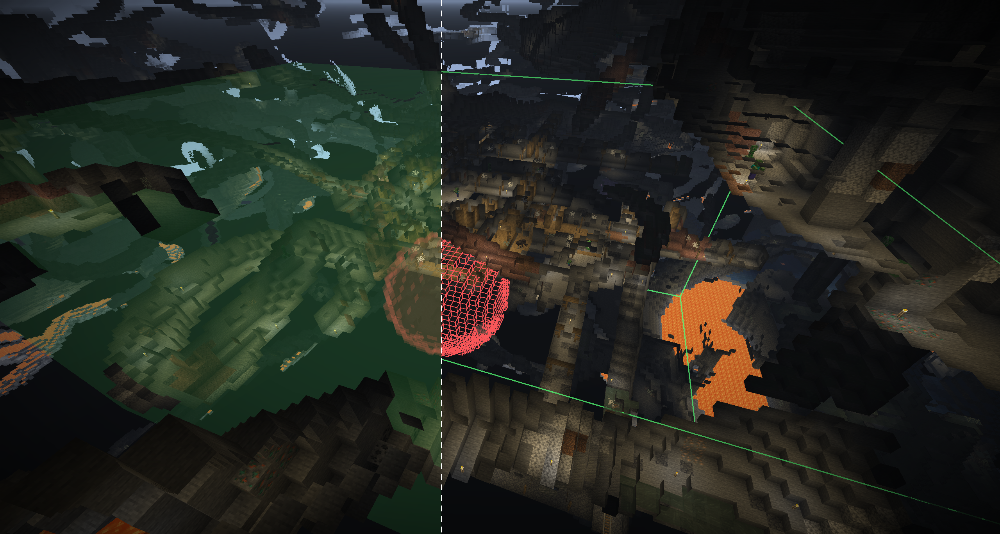
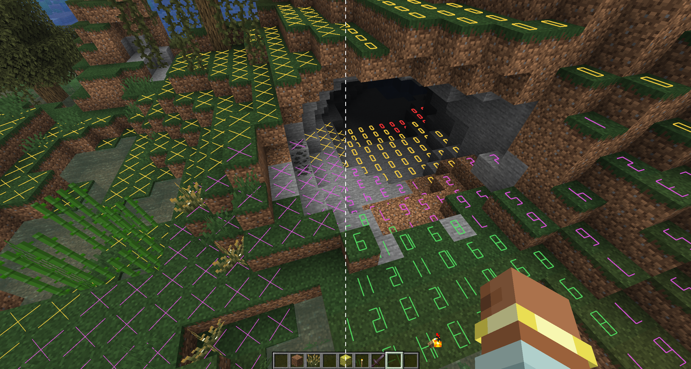
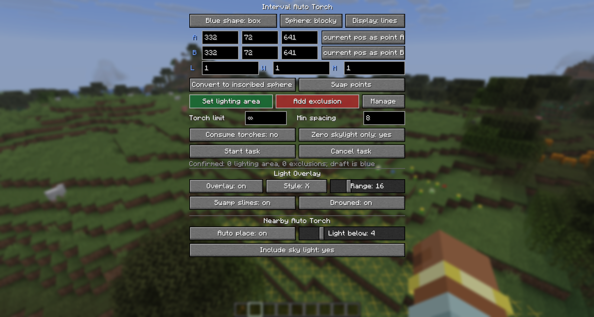

# Auto Torch

English | [简体中文](README.md)

An automatic torch placement mod for Minecraft 26.1.2 / NeoForge 26.1.2.


## Motivation

Digging out a perimeter is tedious, and placing every torch by hand makes it easy to miss spots.

## Overview

- Press `G` by default to open the selection panel and configure automatic torch placement within a selected area or near the player.
- Press `F7` by default to toggle the client-side light level overlay, including special checks for drowned and swamp slimes.

## Screenshots





## Features

- Press `G` by default to open the selection panel. The key binding can be changed in Minecraft's Controls settings.
- Press `F7` by default to toggle the client-side light level overlay, or toggle it from the `G` panel. The overlay supports X markers and numeric block light levels, with a configurable horizontal display radius from `1` to `64` blocks (16 by default). Nearby ranges retain fast refreshes, while larger ranges automatically wait longer between full rescans. X markers show only dangerous positions, while numbers show all eligible positions. Red indicates danger at any time, yellow indicates danger at night, and green indicates safety. Optional checks for swamp slimes and drowned are disabled by default; purple indicates a swamp slime risk and cyan indicates a drowned risk.
- The `G` panel includes a client-side "Auto Torch Nearby" mode, disabled by default. It searches for valid placement positions within about two blocks of the player and uses vanilla right-click interaction to place regular torches when the light level is below a configurable threshold. Sky light can optionally be included in the light calculation.
- Select two points, A and B, to define a sphere or cuboid. A sphere is centered on A, with the distance from A to B as its radius.
- Convert a cuboid draft to its inscribed sphere, or a sphere draft to its circumscribed cube. Converting automatically updates the selection coordinates.
- While holding a wooden axe, left-click a block to set point A and right-click a block to set point B, similar to WorldEdit. The wooden-axe selection interaction can be disabled at the bottom of the panel to restore vanilla axe behavior.
- A/B drafts are shown in blue, the confirmed scan area in green, and all exclusion areas in red.
- The "Areas" button controls selection visibility, while the display-mode button at the top switches between faces and outlines. These settings do not affect the light level overlay.
- Server-side scanning is processed in batches with both per-task and server-wide scan and placement budgets. Active tasks rotate through the shared budget.
- Torches are placed only near positions where block light is 0, the foot and head spaces are empty, and the ground is safe to stand on.
- By default, only underground areas with a sky light level of 0 are scanned.
- The selection is traversed in a randomized order without duplicates, and areas already lit are skipped based on real-time light levels.
- The first pass respects the configured minimum spacing. A second pass uses tighter spacing to fill dark cave corners.
- Configure up to one lighting area and add up to 32 spherical or cuboid exclusion areas. The management page lists every area for individual editing or deletion.
- The default torch limit is unlimited, or it can be set from 1 to 4096 per task.
- Survival mode never consumes torches from the inventory. In Creative mode, inventory consumption is optional and disabled by default.

## Configuration

NeoForge automatically creates two configuration files after the first launch:

- `config/autotorch-client.toml`: Stores client preferences for nearby automatic torch placement, the light level overlay, selection rendering, and task panel defaults.
- `<world directory>/serverconfig/autotorch-server.toml`: Stores server limits for selection dimensions, torch counts, exclusion areas, concurrent tasks, and per-task and server-wide work budgets.

Server configuration and server-side validation always take precedence. Even if a Survival player sends modified network data, inventory consumption is forcibly disabled.

## Building

Java 25 is required:

```powershell
$env:JAVA_HOME='path to your Java 25 installation'
.\gradlew.bat build
```

The generated JAR is located at `build/libs/autotorch-x.x.x.jar`.

On Windows, you can also start the development client with `tools\1.一键启动mc脚本.ps1`.

## Usage

Nearby automatic torch placement is entirely client-side, so the server does not need this mod. You must have regular torches in your offhand or hotbar, and placement remains subject to the server's building permissions and interaction range. Enable the feature at the bottom of the `G` panel and adjust the light threshold as needed.

Area-based batch lighting still requires the following steps:

1. Install the mod on both the client and server. For single-player, installing it on the client is sufficient because the integrated server loads it automatically.
2. Join a world and press `G`.
3. Use a wooden axe to left-click and right-click the A/B points. You can also enter coordinates in the panel or use the current-position buttons.
4. Select "Sphere" or "Cuboid." If needed, use the conversion button to create an inscribed sphere or circumscribed cube. After confirming A/B, click "Set as Lighting Area" or "Add Exclusion Area."
5. You can configure one lighting area and multiple exclusion areas. Open the management page to edit or delete them individually, and switch between face and outline rendering from the main page.
6. Click "Start Task." Reopen the panel to cancel an active task.

## Limits and Safety

- By default, each side of a cuboid is limited to 256 blocks, while a sphere is limited to a radius of 160 blocks (320-block diameter). Server administrators can lower these limits within the protocol's hard limits.
- Unlimited mode is still limited by the number of valid positions in the selection. When inventory consumption is enabled in Creative mode, it is also limited by the number of torches in the inventory.
- The mod does not force-load chunks. Unloaded chunks encountered during scanning are skipped.
- The spawnability check uses conservative rules suitable for common vanilla hostile mobs and may not cover special spawning rules added by other mods.
- Direct server-side placement does not automatically integrate with land-claim plugins. Public servers should restrict the mod to trusted players or integrate with the server's protection API.
- When improving mob farm efficiency, center the selection around the effective spawning range of the AFK position and ensure that exclusion areas fully cover the farm.
