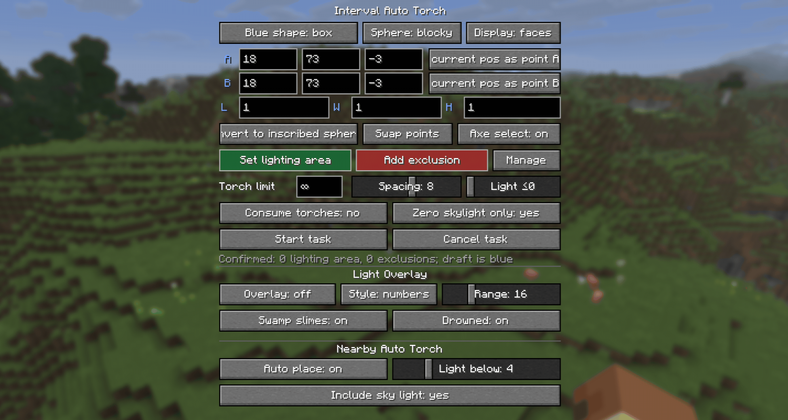

# Auto Torch

English | [简体中文](../../README.md)

An automatic torch placement and light level overlay mod for Minecraft 1.7.10~26.3 on NeoForge, Forge, and Fabric.


## Motivation

Digging out an area is tedious, and placing torches by hand makes it easy to miss spots. Existing light level overlays also do not handle the special spawning conditions of drowned and swamp slimes, which makes building swamp mob farms or lighting riverbeds inconvenient. That is why this mod was created.

## Overview

- Press `G` by default to open the selection panel, where you can configure automatic torch placement within an area or near the player.
- Press `F7` by default to toggle the light level overlay, including special checks for drowned and swamp slimes.

| Nearby Torch Placement | Light Level Overlay | Area Torch Placement |
| ---------------------- | ------------------- | -------------------- |
| Client-side only       | Client-side only    | Client and server    |

## Screenshots




## Usage

- Press `G` by default to open the selection panel and `F7` to toggle the light level overlay. The key bindings can be changed.
- Commands are also available; see the [command usage documentation](../命令使用.md) for the complete syntax.
- Light level overlay:
  Supports `X` markers, numeric light levels, and boxed numeric light levels. The display range is 1-64 blocks horizontally and up to 64 blocks both above and below vertically (64 blocks maximum), with performance optimizations.
  | Color | Meaning |
  | ----- | ------- |
  | Red | Mobs can spawn at any time |
  | Yellow | Mobs can spawn at night |
  | Green | Mobs cannot spawn |
  | Purple | Swamp slimes can spawn at night |
  | Cyan | Drowned can spawn |
- Nearby automatic torch placement:
  Searches for valid positions within two blocks of the player and uses right-click interaction to place torches from the inventory. A torch is placed only when the light level is below the threshold; you can choose whether sky light is included in the calculation.
- Area automatic torch placement:
  Select points A and B to define a cuboid (opposite corners) or sphere (center and radius), with wooden axe selection support. Set the selection as a lighting area (green) or exclusion area (red), adjust the block-light threshold, and click `Start Task`. One lighting area and multiple exclusion areas are supported.
- All features are available in the settings panel shown above.

## Building

```powershell
.\gradlew.bat build
```

The generated JAR is automatically copied to the root `build` directory and renamed to:

- `build/v<mod version>/autotorch-v<mod version>-mc<MC version>-<loader type>.jar`

Run a development client with:

```powershell
.\gradlew.bat :neoforge:runClient
.\gradlew.bat :forge:runClient
.\gradlew.bat :fabric:runClient
```

On Windows, you can also run `tools\1.一键启动mc脚本.py`.

## Contributing Translations

Contributions that add or improve translations are welcome. Language files are located in `common/src/main/resources/assets/autotorch/lang/`.

Different Minecraft versions use different maintenance branches and language file formats:

| Minecraft Version | Pull Request Target Branch | Language File Format |
| ----------------- | -------------------------- | -------------------- |
| Current development version (latest) | `main` | `.json` |
| 1.7.10~1.12.2 | `mc/<version>` | `.lang` |
| 1.13.2 and later | `mc/<version>` | `.json` |

When contributing a translation, submit the `.json` file in a pull request targeting `main`. Do not submit it to another `mc/x.x.x` branch; it will be merged manually later.

> `.json` files are automatically converted to `.lang` files by a script.

1. Fork this repository and create a new branch from `main`.
2. Copy `zh_cn.json` in the target branch, then translate it manually or with the help of AI (manual proofreading is recommended).
3. Add a README file for the corresponding language.
4. Commit the translation and make sure the file uses `UTF-8` encoding.

## Detailed Description

### Nearby Automatic Torch Placement

- When enabled, the mod scans every 10 ticks (0.5 seconds) within a horizontal radius of 2 blocks and a vertical range of -2 to +1 blocks around the player. It places torches from near to far; a failed position is retried after 40 ticks (2 seconds).
- Torches are placed only in air blocks without fluid, where a torch can remain in place and will not collide with the player.
- A torch must be available in the hotbar or offhand.
- You can set the light level threshold that triggers placement (1-16) and choose whether sky light is included in the calculation.

### Light Level Overlay

- Press `F7` by default to toggle it, or configure it in the `G` panel.
- Centered on the current view, the horizontal display range can be set to 1-64 blocks. Vertically, up to 64 blocks can be selected in each direction (64 blocks maximum). Free-camera and similar mods are supported.
- `X` markers, numeric light levels, and boxed numeric light levels are supported.
- See-through rendering is supported, and numbers can rotate with the view.
- Markers check whether mobs can spawn at the current position, including the special spawning conditions of swamp slimes and drowned, and use different colors to identify the results.

### Area Automatic Torch Placement

- Enter coordinates or select two points by left- and right-clicking with a wooden axe.
- A cuboid uses A and B as opposite corners. A sphere uses A as its center and the straight-line distance from A to B as its radius.
- You can configure one green lighting area and multiple red exclusion areas. Several display modes are available.
- Set the task's maximum block light (0-15). The task processes positions whose block light is at or below that value, with air at two blocks of height, a block that can be stood on, and block light 0 at the placement position. Positions with sky light can be skipped.
- The mod first prefers placing a torch beneath a dark position. If that is not possible, it randomly searches nearby for a valid position. Only loaded chunks are processed; chunks are never force-loaded.
- Scanning runs in two passes: the first uses the configured minimum spacing, and the second uses a smaller spacing to fill remaining gaps.
- You can limit the maximum number of torches placed by a task; `0` means unlimited. You can also choose whether regular torches in the inventory are consumed.
- Each player can have only one task at a time. A new task replaces the old one.

## Configuration Files

Two types of configuration files are generated automatically after the first launch.
Boolean options in configuration files use `true` or `false` without quotation marks.

### Client Configuration

File: `config/autotorch-client.toml`

```toml
[nearbyAutoTorch]
# Whether nearby automatic torch placement is enabled.
enabled = false
# Attempt to place a torch when the light level is below this value. Range: 1-16.
lightThreshold = 4
# true: use the greater of block light and sky light; false: use block light only.
includeSkyLight = false

[lightOverlay]
# Whether the light level overlay is enabled.
enabled = false
# Whether see-through rendering is enabled so markers can be seen through blocks.
renderThrough = false
# true: numbers rotate with the view; false: numbers remain fixed.
numberRotation = true
# Horizontal display range centered on the current camera. Range: 1-64 blocks.
horizontalRange = 16
# Number of blocks scanned downward from the current camera. Range: 0-64; the sum with upRange must not exceed 64.
downRange = 16
# Number of blocks scanned upward from the current camera. Range: 0-64; the sum with downRange must not exceed 64.
upRange = 4
# Display style: 0 = X markers, 1 = numbers, 2 = boxed numbers.
mode = 0
# Whether to mark locations that meet the vanilla spawning conditions for swamp slimes.
detectSwampSlimes = false
# Whether to mark locations that meet the vanilla spawning conditions for drowned.
detectDrowned = false

[selectionOverlay]
# Whether to display the lighting area and exclusion areas.
enabled = true
# true: show outlines only; false: show translucent faces.
linesOnly = false
# Whether to use smoother rendering for spherical selections.
smoothSpheres = false

[lightingTaskDefaults]
# Default maximum number of torches per task. Range: 0-4096; 0 means unlimited.
maxTorches = 0
# Default minimum spacing between torches. Range: 1-12 blocks.
minSpacing = 8
# Process positions whose block light is at or below this value. Range: 0-15; 0 means block light 0 only.
lightThreshold = 0
# Whether to process only positions without sky light by default.
undergroundOnly = true
# Whether Creative mode consumes torches from the inventory by default.
creativeConsumeTorches = false
# Whether Survival mode consumes torches from the inventory by default in single-player.
# In multiplayer, the server's gameplay.survivalConsumesTorches setting takes precedence.
survivalConsumeTorches = true
# Whether left- and right-clicking with a wooden axe selects points A and B.
woodenAxeSelectionEnabled = true
```

### Server Configuration

File: `<world directory>/serverconfig/autotorch-server.toml`
Single-player location: `config/autotorch-server.toml`

```toml
[limits]
# Maximum allowed length of any side of a cuboid. Range: 1-321 blocks.
maxBoxAxisLength = 321
# Maximum allowed radius of a spherical selection. Range: 1-160 blocks.
maxSphereRadius = 160
# Maximum number of exclusion areas allowed in a single task. Range: 0-32.
maxExclusions = 32
# Maximum number of torches that can be set for a single task. Range: 1-4096.
maxTorchesPerTask = 4096
# Whether clients may set the maximum torch count to 0 (unlimited).
allowUnlimitedTorches = true
# Lower and upper bounds for torch spacing configurable by clients. Both range from 1-12.
minSpacing = 1
maxSpacing = 12
# Maximum number of tasks that can run concurrently across the server. Range: 1-1024.
maxConcurrentTasks = 64

[gameplay]
# Whether Survival mode tasks must consume regular torches from the player's inventory.
survivalConsumesTorches = true

[performance]
# Maximum number of blocks scanned by each task per tick. Range: 1-120000.
scanBudgetPerTaskTick = 12000
# Maximum number of torches placed by each task per tick. Range: 1-64.
placeBudgetPerTaskTick = 8
# Maximum total number of blocks scanned by all tasks per server tick. Range: 1-240000.
globalScanBudgetPerTick = 24000
# Maximum total number of torches placed by all tasks per server tick. Range: 1-256.
globalPlaceBudgetPerTick = 16
# Maximum number of attempts to find a valid torch position near each dark position. Range: 1-128.
randomPlacementAttempts = 32
```

## Other

- "Can spawn" uses conservative checks suitable for common vanilla hostile mobs and does not include special handling for other mods.
- Land-claim plugins are not supported. Placement uses the vanilla `/setblock` command.
- No practical use has been found for displaying sky light, so there are currently no plans to add it.
